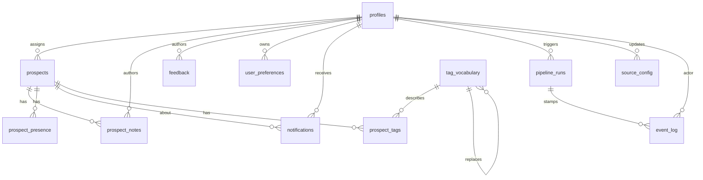

# Architecture

WHRB Prospects is a two-package monorepo: a Python pipeline that scrapes
public data sources into a deduplicated prospect list, and a Next.js 15
sales console where the WHRB sales team works that list. Both halves
write into the same Supabase project (Postgres + RLS + Realtime). This
doc is the developer-and-operator-facing system map. ICP and rollout
history live in [`whrb-prospects/CLAUDE.md`](../whrb-prospects/CLAUDE.md)
and [`ROLLOUT.md`](../ROLLOUT.md); cross-reference rather than duplicate.

State as of T1 exit: `tag_vocabulary` and `prospect_tags` exist and are
seeded with the 73 canonical vocab rows. **No tags are emitted by the
pipeline yet** (T2 ships emitters) and **no rep UI surfaces tags** (T3).
The admin `/admin/vocab` page is the only T1 surface that reads or
writes either tag table.

---

## System map

```
                ┌──────────────────────────────────────────────┐
                │      Public data sources (REST + HTML +      │
                │      PDF + Playwright + open-data APIs)      │
                └──────────────────────┬───────────────────────┘
                                       │
                                       ▼
                ┌──────────────────────────────────────────────┐
                │   whrb-prospects/  (Python 3 pipeline)       │
                │  collect → enrich → dedupe → score → sync    │
                │  (8 phases, two-layer checkpointing,         │
                │   tenacity retry, requests-cache 24h)        │
                └──────────────────────┬───────────────────────┘
                                       │  upsert + event_log
                                       ▼
                ┌──────────────────────────────────────────────┐
                │   Supabase (Postgres + RLS + Realtime)       │
                │  10 core tables + 2 T1-new tag tables        │
                │  (tag_vocabulary, prospect_tags)             │
                └────────────┬───────────────────┬─────────────┘
                             │                   │
                             ▼                   ▼  Realtime
                ┌──────────────────────┐  ┌──────────────────────┐
                │  Next.js 15 web UI   │  │  GitHub Actions      │
                │  (Vercel-deployed)   │  │  pipeline dispatch   │
                │  rep + admin pages   │  │  (cron + on-demand)  │
                └──────────┬───────────┘  └──────────┬───────────┘
                           │                          │
                           ▼                          ▼
                  Sales rep (browser)         Pipeline run (Linux)
```

---

## Pipeline phases

`pipeline.py` orchestrates an 8-phase pipeline. Every phase emits
`event_log` rows with the same `pipeline_run_id` so an operator can
trace a single run end-to-end at `/admin/runs/[id]`.

| # | Phase | Module | Resumable? |
|--:|-------|--------|------------|
| 01 | `01_collected` — pull rows from each enabled source | `sources/*.py` | Yes (per-source checkpoint) |
| 02 | `02_normalized` — coerce websites + phones, fold variants | `enrich/contact_scraper.py`, `util/normalize.py` | Yes |
| 03 | `03_deduped` — fuzzy merge by `business_key` | `enrich/dedupe.py` | Yes |
| 04 | `04_email_enriched` — Hunter / Apollo / contact-page scrape | `enrich/{hunter_free,apollo_free,contact_scraper}.py` | Yes |
| 05 | `05_validated` — drop bouncing emails | `enrich/email_validate.py` | Yes |
| 06 | `06_scored` — apply `score()` | `pipeline.py::score` | No (cheap) |
| 07a | `07a_nonprofit` — IRS BMF EIN match | `db/nonprofit_bmf.py` | Yes |
| 08 | `08_supabase_sync` — upsert with edit-lock | `db/supabase_sync.py` | No (transactional) |

Skip with `--no-supabase` for local dry runs. `--fresh` clears phase +
source checkpoints but **preserves** `cache/http_cache.sqlite` so
re-fetches do not re-spend rate-limited quota.

T2 will append phase `08b_tag_sync` after `08_supabase_sync` to upsert
`prospect_tags` rows from emitter output.

---

## Data sources

| Source | Tier served | Method | Enabled by default | Notes |
|--------|-------------|--------|--------------------|-------|
| `chambers.py` | A, B | REST + HTML | Yes | HSBA + ArtsBoston. Two-pass for HSBA detail pages. |
| `city_licenses.py` | B, C | Socrata + CKAN | Yes | Cambridge / Somerville Socrata + Boston food. Cap 500. |
| `osm_overpass.py` | B | Overpass API | Yes | OSM categories scoped to `WHRB_BBOX`. |
| `yelp_fusion.py` | B | Yelp Fusion API | Yes | Optional API key. Better than Google for Boston. |
| `ma_hic.py` | C | REST | Yes (with `--with-hic`) | MA Home Improvement Contractors. |
| `ma_sos.py` | A, B | Playwright | Yes | Officer-name lookup, persistent browser. |
| `bbb.py` | A, B | Playwright | No (`--with-bbb`) | Flaky; Better Business Bureau. |
| `program_books.py` | A | PDF | Yes | BSO / H+H / A.R.T. program-book sponsor extraction. |
| `best_of_boston.py` | B | (stubbed) | No | Site returns 403; placeholder returns []. |

T5 / T6 / T7 / T8 add competitor-station, Harvard, ensemble, regional,
and Playwright-heavy sources — see plan `gleaming-dawn.md`.

`source_config` (Postgres) drives the runtime enable/disable from
`/admin/sources`. The pipeline reads it at run start; admins can flip
flags between runs without redeploying.

---

## Dedupe contract

`enrich/dedupe.py`:

- **Match key:** `business_key`
  - Primary: 10-digit normalized phone (`util/normalize.py::normalize_phone`).
  - Fallback: `slug(company_name)|zip` when phone missing.
  - Last-resort: `manual-{uuid}` for rows added via the admin UI.
- **Fuzzy threshold:** rapidfuzz token-set ratio.
  - `92` when both rows have a matching ZIP.
  - `97` when either ZIP is missing (tighter to avoid false merges).
- **Tier resolution:** preserves the strongest tier independently of
  field completeness via `_best_tier` + `TIER_RANK={A:3,B:2,C:1}`.
- **Conflict preservation:** `CONFLICT_PRESERVE_FIELDS` writes the
  loser's divergent value to `alt_<field>` on the surviving row.
- **Merge history:** every merge emits `event_log.category='dedupe_match'`
  with the loser + winner ids. T4 will use this for source-attribution
  close-rate.

Tag merges (T2 onward) follow the same pattern: a winning row inherits
both rows' `prospect_tags`, `unique (prospect_id, tag_id)` collapses
duplicates, and an `event_log.category='tag_merge_dedupe'` row records
the action.

---

## Supabase schema

10 core tables (Stage 1) + 2 T1-new tag tables. Full column / index /
RLS detail in [`docs/DATA-MODEL.md`](DATA-MODEL.md). Mermaid ERD:



**Triggers (8 total):**

- `on_auth_user_created` — auto-create `profiles` row on signup.
- `set_updated_at` — generic stamp on prospects, source_config,
  user_preferences, tag_vocabulary.
- `set_edited_at` — note-edit stamp gated on body-changed + not-deleted.
- `audit_prospect_change` — emit per-changed-column `event_log` rows.
- `on_rep_tag_vocab_insert` (T1) — force `pending_admin_review` for
  non-admin inserts; fan out admin notifications.
- `audit_prospect_tag_change` (T1) — emit `prospect_tag_added` /
  `prospect_tag_removed` events.

**RPCs:**

- `merge_tag_vocabulary(p_source_id, p_target_id)` (T1) — same-axis
  merge; raises `P0002` on cross-axis attempts (the API translates to
  HTTP 400).

---

## Web app topology

`whrb-web/` is a Next.js 15 App Router app deployed on Vercel.

**Route groups:**

- `app/(auth)/login/` — magic-link entry; PKCE flow, hash-token fallback
  for admin-generated invites that arrive via email link.
- `app/(app)/` — auth-gated. Layout reads the session, redirects to
  `/login` if missing, then mounts the persistent `<Nav>` and
  `<footer>`. New T1 routes: `/admin/vocab`, `/guide`, `/media-kit`.
- `app/api/` — route handlers. **Every admin route enforces
  `getAuthed() + role==='admin'`** locally; do not rely on layout-only
  gating for write paths.

**Server / client split:**

- Default to **React Server Components**. Browser hydration only when
  interaction is required.
- Server-only modules (queries, env reads) import `'server-only'`.
- Service-role Supabase client is created via
  `lib/supabase/service.ts` and only imported from server-only files.

**Auth flow:**

1. Rep enters email at `/login`.
2. Supabase emails magic link with PKCE code.
3. Browser opens link, exchanges code at `/auth/callback`, gets session
   cookies.
4. Middleware (`middleware.ts`) refreshes the session on every request
   and writes cookies for the SSR client.
5. Admin invites use `service.auth.admin.inviteUserByEmail` and arrive
   with hash-token fragments (`#access_token=...`); the browser-side
   handler in `app/auth/...` upgrades to a session cookie.

---

## Event logging

Three streams converge on the single `event_log` table:

1. **Pipeline (Python):** `whrb-prospects/util/event_log.py` buffers
   rows in-memory (50 events) and flushes via `atexit` + every batch.
   Every row stamps `pipeline_run_id`.
2. **Web server (Next.js route handlers):** `lib/logging/server.ts` —
   `logEvent(...)` posts directly via the service-role client.
   Fire-and-forget, never raises.
3. **Web client (browser):** `lib/logging/client.ts` — render errors
   from `<ErrorBoundary>` and unhandled promise rejections are
   POSTed to `/api/log`, then forwarded to `event_log` server-side.

Severity levels: `debug | info | warn | error | fatal`. Every stage
exit runs:

```sql
select count(*) from event_log
 where level in ('error','fatal')
   and created_at > '<stage_start>';
```

Result must be `0` (or every survivor explicitly explained in the
ROLLOUT entry).

---

## Deployment

- **Vercel project:** `whrb-prospects-dev` pointed at the monorepo
  subdirectory `whrb-web/`. Production project is created at Stage 11
  cutover (currently parked).
- **Supabase project:** `WHRB dev` (`kolfijjavwruwzctmnlx`). Production
  project created at Stage 11.
- **GitHub Actions:** `.github/workflows/run-pipeline.yml` handles both
  `repository_dispatch` (admin-triggered run from `/admin/runs`) and a
  `cron: '0 8 1,15 * * UTC'` schedule (twice-monthly).
- **Secrets:** see `whrb-prospects/.env` (gitignored). Vercel envs +
  GitHub repo secrets mirror the keys the pipeline + web app need.
  Rotation procedure in [`docs/RUNBOOK.md`](RUNBOOK.md).

---

## Forward-looking notes (post-T1)

- **T2** ships pipeline tag emitters + `08b_tag_sync` phase + the
  cannabis-block list + the daypart `compute-on-read` SQL view.
- **T3** ships `<TagChips>`, `<TagAddDialog>`, preset-filter chips,
  per-tag lock UI, undo toasts, and the rep-add notification surfacing.
- **T4** ships `/admin/sources` close-rate / dup-rate / searched-vs-default
  instrumentation, the `/guide` content body, and the `/media-kit`
  interactive content body.
- **T5–T8** ship new source modules (peer stations, Harvard, ensembles,
  Playwright-heavy regional sources). Each adds vocab values to
  `tag_vocabulary` in its own migration.

See [`gleaming-dawn.md`](../.claude/plans/users-countcowy-downloads-media-kit-202-gleaming-dawn.md)
(local) for full per-stage detail.
